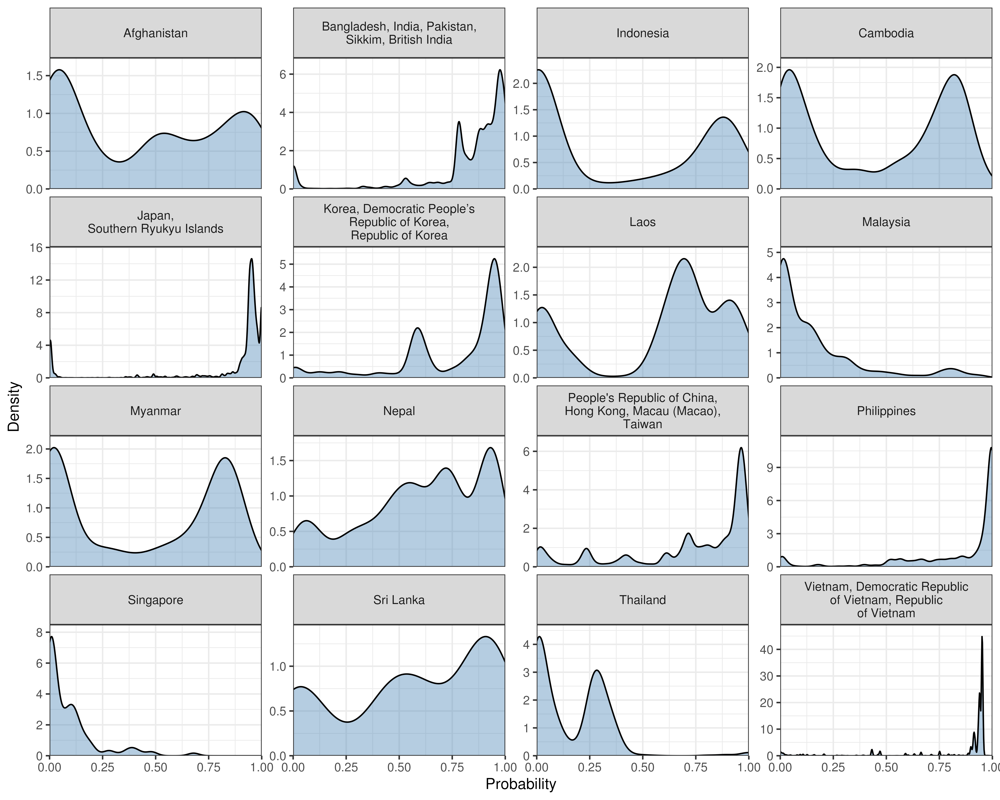

 
```{r setup, include=FALSE}
knitr::opts_chunk$set(echo=FALSE, 
                      message=FALSE,
                      warning=FALSE)

require(tidyverse)
require(data.table)

require(knitr)      # For generating nice and organized results
require(kableExtra) # For generating nice and organized results
require(readxl)
```

```{r data}
# Load the formatted matrices
load(file="data/interm/formatted.Rdata")

# Collapse matrices back to summary dataframe
cntrmat_triplet <- as(cntrmat, "TsparseMatrix")
cntr <- data.frame(area = rownames(cntrmat)[cntrmat_triplet@i + 1],
                   surname = colnames(cntrmat)[cntrmat_triplet@j + 1],
                   freq = cntrmat_triplet@x)

ntvmat_triplet <- as(ntvmat, "TsparseMatrix")
ntv <- data.frame(area = rownames(ntvmat)[ntvmat_triplet@i + 1],
                  surname = colnames(ntvmat)[ntvmat_triplet@j + 1],
                  freq = ntvmat_triplet@x)

# Load the reportable lists
load(file="data/interm/resultRep.Rdata")

# Load the validation summary with the Census list
load("data/interm/validateCensus.Rdata")

# Load the validation summary through cross-validation
load("data/interm/validateCV.Rdata")

# Load the validation summary with the KP cohort
load("data/interm/validateKP.Rdata")
```

```{r prep}
# Create a lookup table
codeLookup <- data.frame(code = c("AF", "BIA", "BM", "BT", "CB", 
                                  "CE", 
                                  "GCA", 
                                  "JA", "LA", "MG", "MV", 
                                  "MY", "NP", "Other", 
                                  "RP", "SAS", 
                                  "SN", "TH", 
                                  "VM", 
                                  "XK"),
                         name = c("Afghanistan", "Brunei, Indonesia", "Myanmar", "Bhutan", "Cambodia",
                                  "Sri Lanka", 
                                  "Peoples Republic of China, Hong Kong, Macau (Macao), Taiwan", 
                                  "Japan, Southern Ryukyu Islands", "Laos", "Mongolia", "Maldives",
                                  "Malaysia", "Nepal", "All the other countries and regions", 
                                  "Philippines", "Bangladesh, India, Pakistan, Sikkim, British India", 
                                  "Singapore", "Thailand", 
                                  "Vietnam, Democratic Republic of Vietnam, Republic of Vietnam", 
                                  "Korea, Democratic People’s Republic of Korea, Republic of Korea"))

# Write a function to replace area codes with names and sort the table
replace_sort <- function(data, code_col, lookup=codeLookup) {
  # Merge the data with the lookup table
  data <- merge(data, lookup, 
                by.x=code_col, by.y="code", all.x=TRUE)
  
  # Remove the original column
  data[[code_col]] <- NULL
  
  # Extract the Other row
  special_row <- data %>% 
    filter(name == "All the other countries and regions")
  
  # Remove the special row from the data
  data <- data %>% 
    filter(name != "All the other countries and regions")
  
  # Sort the remaining data
  data <- data %>% 
    arrange(name)
  
  # Bind the special row at the bottom
  data <- bind_rows(data, special_row)
  
  return(data)
}
```
In this document, I made some tables for our manuscript to illustrate our analysis process and results.

# Table 1. Illustrative surnames from the Probabilistic List and the estimated probabilities of origins from each area conditional on having the corresponding surnames
```{r tab1}
nameSample <- str_pad(c("HUANG", "CHANG", "KIM", "SUZUKI", "NGUYEN", "INTHAVONG", "VICENCIO", "SAMEER", "PATAN"),
                      12, side="right")
tab1 <- probList %>% 
  filter(surname %in% str_pad(nameSample, 12, side="right")) %>% 
  mutate(surname = factor(surname, levels=nameSample)) %>% 
  arrange(surname) %>% 
  select(-surname) %>% 
  mutate(across(.cols=everything(), .fns=~round(.x, 4)*100)) %>% 
  t() %>% 
  as_tibble() %>% 
  mutate(endCol = colnames(probList)[1:20])
colnames(tab1) <- c(nameSample, "area")

# Replace area codes with actual names
tab1 <- replace_sort(tab1, "area") %>% 
  select(name, nameSample) %>% 
  rename(`Illustrative surnames` = name)

tab1 %>% 
  t() %>% 
  kbl(align="l", booktabs=TRUE) %>% 
  kable_styling(latex_options = c("hold_position")) %>%
  column_spec(1, width="1.5cm") %>% 
  column_spec(2:21, width="1.2cm") %>% 
  add_header_above(header=c(" "=1, "Country/Area of origin[note]"=20)) %>% 
  add_footnote("Note: This table exemplifies the Probabilistic List with some illustrative surnames. Each column represents one illustrative surname. Numbers in the row denote the probabilities of someone originating from the corresponding area conditional on having corresponding surnames. Probabilities in each row may not add up to 1 due to rounding error.",
               notation="symbol",
               threeparttable=TRUE)%>%
  kable_styling(font_size=7)
```

We also checked the number of surnames that reached 12-character limit:

```{r}
surnames_trimmed <- str_trim(surnames, side="right")

num <- sum(str_length(surnames_trimmed) == 12)
prop <- sum(str_length(surnames_trimmed) == 12) / length(surnames_trimmed)

print(paste0("N = ", num, ", representing ", round(prop, 2), "% of surnames."))
```

\newpage

# Table 2. Numbers of surnames in the Deterministic List that are predictive for each area of origin, with the number of US-born and foreign-born SSN records having that surname
```{r tab2}
tab2Area <- function(areaCode){
  # Identify surnames associated with the corresponding areaCode
  tab2Names <- determList %>% 
    filter(area == areaCode)
  
  # Make column 1: Country/Area
  col1 <- areaCode
  # Make column 2: Number of highly predictive surnames
  col2 <- nrow(tab2Names)
  # Make column 3: Number of records in the US-born with these highly predictive surnames
  tab2Ntv <- ntv %>% 
    filter(surname %in% tab2Names$surname) 
  col3 <- sum(tab2Ntv$freq)
  # Make column 4: Number of records in the foreign-born file with these highly predictive surnames
  tab2Cntr <- cntr %>% 
    filter(surname %in% tab2Names$surname) 
  col4 <- sum(tab2Cntr$freq)
  
  # Construct the result
  result <- tibble(area = col1,
                   nameNum = col2,
                   ntvTotal = col3,
                   cntrTotal = col4)
}

tab2 <- lapply(codeLookup$code, tab2Area) %>% 
  data.table::rbindlist()

# Replace area codes with actual names
tab2 <- replace_sort(tab2, "area") %>% 
  select(name, nameNum, ntvTotal, cntrTotal) %>% 
  filter(name != "All the other countries and regions")

tab2 %>% 
  kbl(col.names=c("Country/Area of origin", "Number of predictive surnames[note]", 
                  "Number of US-born records with corresponding predictive surnames",
                  "Number of foreign-born records with corresponding predictive surnames"),
      format.args=c(big.mark=","), align="l", booktabs=TRUE) %>%
  kable_styling(latex_options = c("hold_position")) %>%
  column_spec(1, width="5cm") %>% 
  column_spec(2:4, width="3cm") %>% 
  add_footnote(c("The numbers do not add up to 22,621 because there are surnames that are equally predictive of more than one country/area.",
                 "Note: The second column of this table presents the numbers of surnames that are predictive of one country/area with a 50% or higher probability. The third and fourth columns are the number of Social Security Number (SSN) application records that have the corresponding surnames."),
               notation="symbol",
               threeparttable=TRUE)
```

# Intext. Validation of the Probabilistic List’s ability to predict the subset of names on the Frequently Occurring Surnames from the 2010 Census that have their most frequent self-reported race/ethnicity as “Asian and Pacific Islander”

This was originally a table but we decided to only report the first row in the text and ignore the other rows as the validation done on KP cohort is more robust and complete.
```{r}
temp <- predictSummary %>% 
  filter(maxCntr == "Whole List") %>% 
  rename(name = maxCntr) %>% 
  mutate(across(.cols=PPV:Specificity, .fns=~round(as.numeric(.x), 4)*100))
```

There are `r temp$nameCount` surnames that appeared in both the Probabilistic List and the list of Frequently Occurring Surnames from the 2010 Census. The sensitivity and specificity of our list are `r temp$Sensitivity` and `r temp$Specificity`, respectively. And the PPV of our list predicting the surnames in the list of Frequently Occurring Surnames from the 2010 Census is `r temp$PPV`.

\newpage
# Table 3. Validation of the Deterministic List’s ability to predict foreign-born population’s ethnicity through cross validation
```{r tab3}
tab3 <- cvResultsSummary %>% 
  select(area:`Pos Pred Value`) 

# Replace area codes with actual names
tab3 <- replace_sort(tab3, "area") %>% 
  select(name, `Pos Pred Value`, Sensitivity, Specificity) %>% 
  filter(name != "All the other countries and regions") %>% 
  mutate(across(.cols=`Pos Pred Value`:Specificity, .fns=~round(as.numeric(.x), 4)*100))

tab3 %>% 
  kbl(col.names=c("Country/Area of origin", "PPV (%)", "Sensitivity (%)", "Specificity (%)"),
      align="l", booktabs=TRUE) %>%
  kable_styling(latex_options = c("hold_position")) %>%
  column_spec(1, width="5cm") %>% 
  column_spec(2:4, width="3cm") %>% 
  add_footnote("Note: The table presents the result of validating the Deterministic List through four-fold cross-validation. In each iteration, 75% of the sample is used to estimate a Probabilistic List. The country/area that each surname predicts with a probability of 50% or higher is then compared with the country/area of birth of samples in the set-aside 25% test set. The results are summarized into a confusion matrix, and Positive Predictive Value (PPV), sensitivity, and specificity are calculated. The table shows the mean results from the four test-set evaluations.",
               notation="none",
               threeparttable=TRUE)
```

\newpage
# Table 4. Sensitivity and specificity of the Probabilistic List when used to predict Asian-origin ethnicity within the Kaiser Permanente Northern California (KPNC) cohort
```{r tab4}
# Combine all sensitivity and specificity sets with an age group identifier
tab4_combined <- bind_rows(
  ssKP %>% mutate(age_group = "Total"),
  ssKP0039 %>% mutate(age_group = "<=39"),
  ssKP4059 %>% mutate(age_group = "40-59"),
  ssKP60GE %>% mutate(age_group = ">=60")
)

# Apply the origin replacements
conditions <- c("Overall Asian", "South Asian Subcontinent", "Korea", "China", "Vietnam")
replace <- c("Asia", "Bangladesh, India, Pakistan, Sikkim, British India",
             "Korea, Democratic People's Republic of Korea, Republic of Korea",
             "Peoples Republic of China, Hong Kong, Macau (Macao), Taiwan",
             "Vietnam, Democratic Republic of Vietnam, Republic of Vietnam")

replacement_map <- setNames(replace, conditions)

tab4_combined <- tab4_combined %>%
  mutate(Origin = case_when(Origin %in% names(replacement_map) ~ replacement_map[Origin],
                            TRUE ~ Origin))

# Pivot to wide format to match your table structure
tab4_wide <- tab4_combined %>%
  pivot_wider(id_cols=Origin,
              names_from=age_group, values_from=c(N, Sensitivity, Specificity),
              names_glue="{.value}_{age_group}") %>%
  select(Origin, 
         N_Total, `N_<=39`, `N_40-59`, `N_>=60`,
         Sensitivity_Total, `Sensitivity_<=39`, `Sensitivity_40-59`, `Sensitivity_>=60`,
         Specificity_Total, `Specificity_<=39`, `Specificity_40-59`, `Specificity_>=60`)

# Create the table
tab4_wide %>% 
  kbl(col.names=c("Country/Area of origin",
                  "Total", "<=39", "40-59", ">=60",   # N columns
                  "Total", "<=39", "40-59", ">=60",   # Sensitivity columns
                  "Total", "<=39", "40-59", ">=60"),  # Specificity columns
      format.args=list(big.mark=","),  align="l",  booktabs=TRUE) %>%
  kable_styling(latex_options=c("hold_position")) %>%
  column_spec(1, width="5cm") %>% 
  column_spec(2:13, width="1.5cm") %>%
  # Add header groups
  add_header_above(c(" "=1, 
                     "Number of populations in KPNC self-reported Asian Cohort"=4,
                     "Sensitivity (%)"=4,
                     "Specificity (%)"=4)) %>%
  add_footnote("Note: The table presents the result of validating the Probabilistic List within the KPNC cohort. The Probabilistic List is estimated with the Social Security Number application record through 2013 using Expectation-Maximization method. KPNC is a large, integrated health care delivery system where >4.6 million members receive comprehensive inpatient, emergency and outpatient care through 21 hospitals and >260 clinics across Northern California. The Probabilistic List’s most probable origin for each surname were compared with the self-reported ethnicity of individuals carrying the same surname in the cohort. Sensitivity, specificity, and PPV in both the self-reported Asian race group and in all known Asian-origin ethnicity groups in the KPNC cohort were calculated for the whole cohort and by age group. Multiethnic Asian and Unknown Asian categories were included only to validate the performance in identifying the Asian race, not specific ethnicities. KPNC did not have an ethnicity choice for Brunei, thus the Indonesia origin here is listed independently. KPNC also did not have ethnicity choices for Maldives and Mongolia, thus these two origins were not evaluated.",
               notation="none",
               threeparttable=TRUE)
```

\eject \pdfpagewidth=425mm \pdfpageheight=297mm
\newpage

# Table 5. Positive predictive value (PPV) of the Probabilistic List when used to predict Asian-origin ethnicity within the Kaiser Permanente Northern California (KPNC) cohort, calibrated by geography
```{r tab5, fig.align='center'}
# Combine all PPV sets with an age group identifier
tab5_combined <- bind_rows(
  pKP %>% mutate(age_group = "Total"),
  pKP0039 %>% mutate(age_group = "<=39"),
  pKP4059 %>% mutate(age_group = "40-59"),
  pKP60GE %>% mutate(age_group = ">=60")
) %>%
  filter(complete.cases(.[1:2]))

# Apply the origin replacements
tab5_combined <- tab5_combined %>% 
  mutate(Origin = case_when(Origin %in% names(replacement_map) ~ replacement_map[Origin],
                            TRUE ~ Origin))

# Pivot to wide format
tab5_wide <- tab5_combined %>%
  pivot_wider(id_cols=Origin,
              names_from=age_group, values_from=c(`Prevalence (US)`, `PPV (US)`, `PPV (Asian, US)`,
                                                  `Prevalence (SF)`, `PPV (SF)`, `PPV (Asian, SF)`),
              names_glue="{.value}_{age_group}") %>%
  select(Origin,
         `Prevalence (US)_Total`, `Prevalence (US)_<=39`, `Prevalence (US)_40-59`, `Prevalence (US)_>=60`,
         `PPV (US)_Total`, `PPV (US)_<=39`, `PPV (US)_40-59`, `PPV (US)_>=60`,
         `PPV (Asian, US)_Total`, `PPV (Asian, US)_<=39`, `PPV (Asian, US)_40-59`, `PPV (Asian, US)_>=60`,
         `Prevalence (SF)_Total`, `Prevalence (SF)_<=39`, `Prevalence (SF)_40-59`, `Prevalence (SF)_>=60`,
         `PPV (SF)_Total`, `PPV (SF)_<=39`, `PPV (SF)_40-59`, `PPV (SF)_>=60`,
         `PPV (Asian, SF)_Total`, `PPV (Asian, SF)_<=39`, `PPV (Asian, SF)_40-59`, `PPV (Asian, SF)_>=60`) %>%
  arrange(Origin) 

# Create the table
tab5_wide %>% 
  kbl(col.names=c("Country/Area of origin",
                  "Total", "<=39", "40-59", ">=60",   # Prevalence columns, US
                  "Total", "<=39", "40-59", ">=60",   # PPV columns, US
                  "Total", "<=39", "40-59", ">=60",   # PPV Asian columns, US
                  "Total", "<=39", "40-59", ">=60",   # Prevalence columns, SF
                  "Total", "<=39", "40-59", ">=60",   # PPV columns, SF
                  "Total", "<=39", "40-59", ">=60"),  # PPV Asian columns, SF
      format.args=list(big.mark=","),  align="l",  booktabs=TRUE) %>%
  add_header_above(c(" "=1, 
                     "Prevalence (%)"=4, "PPV (%)"=4, "PPV conditional on Asian (%)"=4, 
                     "Prevalence (%)"=4, "PPV (%)"=4, "PPV conditional on Asian (%)"=4)) %>%
  add_header_above(c(" "=1, "Nationwide"=12, "San Francisco metropolitan area"=12)) %>%
  kable_styling(latex_options=c("hold_position"),
                position = "center") %>%
  column_spec(1, width="3.5cm") %>% 
  column_spec(2:13, width="1cm") %>% 
  add_footnote("Note: The table presents the result of validating the Probabilistic List within the KPNC cohort. The Probabilistic List is estimated with the Social Security Number application record through 2013 using Expectation-Maximization method. KPNC is a large, integrated health care delivery system where >4.6 million members receive comprehensive inpatient, emergency and outpatient care through 21 hospitals and >260 clinics across Northern California. The Probabilistic List’s most probable origin for each surname were compared with the self-reported ethnicity of individuals carrying the same surname in the cohort. Positive predictive value (PPV) in both the self-reported Asian race group and in all known Asian-origin ethnicity groups in the KP cohort were calculated. We then used the prevalence of Asian race group in the U.S. and San Francisco metropolitan area from the 2018-2022 American Community Survey 5-Year Estimates (ACS5) to estimate the PPVs in the corresponding area. Multiethnic Asian and Unknown Asian categories were included only to validate the performance in identifying the Asian race, not specific ethnicities. KPNC did not have an ethnicity choice for Brunei, thus the Indonesia origin here is listed independently. KPNC also did not have ethnicity choices for Maldives and Mongolia, thus these two origins were not evaluated. ACS5 did not include Afghans and Singaporean as ethnicity choices, thus these two origins were not evaluated either. We used estimates from ACS5’s San Francisco-Oakland-Hayward metropolitan area estimates, which is labeled in the MET2013 variable.",
               notation="none",
               threeparttable=TRUE)
```


\eject \pdfpagewidth=420mm \pdfpageheight=297mm
\newpage

# Table 6. Population distribution estimates using the Probabilistic List compared with observed frequencies in the Kaiser Permanente Northern California (KPNC) cohort
```{r}
tab6 <- read_excel("results/validate/validateResultsKP2.xlsx", sheet=7) %>% 
  select(-origin) %>% 
  mutate(ProbList_Freq = round(ProbList_Freq * 100, 2),
         KP_freq = round(KP_freq * 100, 2))

# Calculate Absolute difference and symmetric relative error rate 
tab6 <- tab6 %>% 
  mutate(ad = abs(ProbList_Freq - KP_freq),
         srer = abs(ProbList_Freq - KP_freq) / ((ProbList_Freq + KP_freq) / 2) * 100) 

# Attach a weighted mean absolute error rate row
tab6 <- tab6 %>% 
  rbind(tibble(Ethnicity = "Weighted mean absolute error",
               ProbList_Freq=NA, KP_freq=NA, ad=sum(tab6$ad * tab6$KP_freq / 100), srer=NA))

# Create the table
tab6 %>% 
  kbl(col.names=c("Country/Area of origin",
                  "Observed frequency in KPNC (%)",
                  "Predicted probabilities (%)",
                  "Absolute difference", 
                  "Symmetric relative error (%)"), 
      format.args=list(big.mark=","),  align="l",  booktabs=TRUE, digits=2) %>%
  kable_styling(latex_options=c("hold_position")) %>%
  column_spec(1, width="5cm") %>% 
  column_spec(2:5, width="3cm") %>% 
  add_footnote("Note: The table presents the result of validating the Probabilistic List at the population level against the observed frequencies in the KPNC cohort. The Probabilistic List is estimated with the Social Security Number application record through 2013 using Expectation-Maximization method. KPNC is a large, integrated health care delivery system where >4.6 million members receive comprehensive inpatient, emergency and outpatient care through 21 hospitals and >260 clinics across Northern California. For each individual, the predicted probability of each origin was calculated based on their surname, and these probabilities were averaged by origin across the entire population to estimate group-level distributions. Absolute difference = |Predicted % - Observed %|. Symmetric relative error = |Predicted % - Observed %|/ ((Predicted + Observed)/2) × 100%. Weighted mean absolute error weights each group's error by its observed frequency in the population.",
               notation="none",
               threeparttable=TRUE)
```

\newpage
# Figure 1. Distribution of predicted probabilities for each self-reported Asian-origin ethnicity using the Probabilistic List in the Kaiser Permanente Northern California (KPNC) cohort
```{r, fig.align='center', echo=FALSE}

```

\newpage
# Sample Table. Numbers of foreign-born records from corresponding country/area - Leftout
```{r sample tab}
# Create sample tab to show the foreign-born frequencies
smpTab <- cntr %>% 
  group_by(area) %>% 
  summarise(obs = sum(freq)) 

# Replace area codes with actual names
smpTab <- replace_sort(smpTab, "area") %>% 
  select(name, obs)

smpTab %>% 
  kbl(col.names=c("Country/Area of birth", "Number of foreign-born records"),
      format.args=c(big.mark=","), align="l", booktabs=TRUE) %>% 
  kable_styling(latex_options = c("hold_position")) %>% 
  column_spec(1:2, width="5cm")
```

<!--
```{r original tab3}
countrySummary <- predictSummary %>% 
  filter(maxCntr != "Whole List") %>% 
  rbind(c("MV", 0, NA, NA, NA))

# Replace area codes with actual names
countrySummary <- replace_sort(countrySummary, "maxCntr") %>% 
  select(name, nameCount, PPV, Sensitivity, Specificity) %>% 
  filter(name != "All the other countries and regions")

tab3 <- predictSummary %>% 
  filter(maxCntr == "Whole List") %>% 
  rename(name = maxCntr) %>% 
  rbind(countrySummary) %>% 
  mutate(across(.cols=PPV:Specificity, .fns=~round(as.numeric(.x), 4)*100))

tab3 %>% 
  kbl(col.names=c(" ", "Number of surnames present in both lists[note]", 
                  "PPV (%)", "Sensitivity (%)", "Specificity (%)"),
      align="l", booktabs=TRUE) %>%
  kable_styling(latex_options = c("hold_position")) %>%
  column_spec(1, width="5cm") %>% 
  column_spec(2:5, width="3cm") %>% 
  add_footnote("The numbers of surnames of countries/areas do not add up to 3,370 because there are surnames that are equally predictive of more than one country/area.",
               notation="symbol",
               threeparttable=TRUE) %>% 
  pack_rows("", 2, 20)
```
-->

